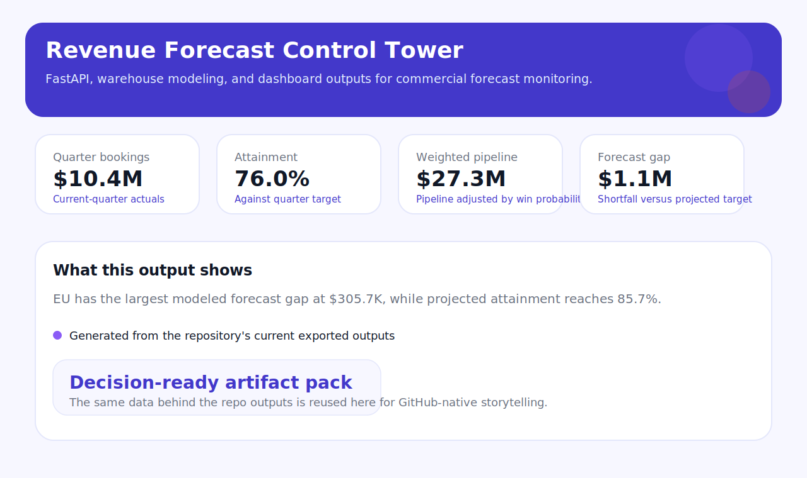
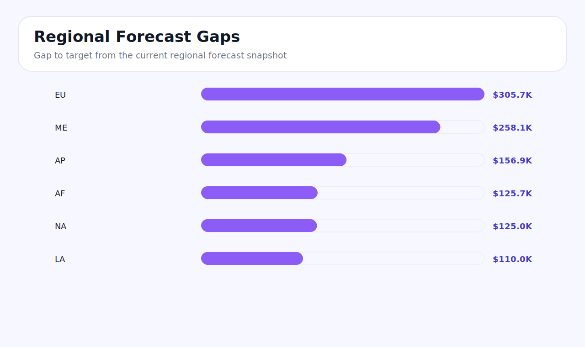

# Revenue Forecast Control Tower

Revenue and operations forecasting platform built to show how Python services, PostgreSQL modeling, AWS Lambda ingestion, SQL reporting, and dashboard delivery can work together in one production-oriented project.

## Platform Summary

- Uses FastAPI to expose forecast, pipeline, alert, and scenario endpoints for downstream dashboards and planning workflows.
- Models a PostgreSQL-first warehouse design with fact tables, reference dimensions, analytical views, and sample SQL used for reporting.
- Includes AWS Lambda handlers for ingesting booking events and publishing alert payloads into downstream systems.
- Ships with a TypeScript dashboard that reads exported snapshot data and renders a control-tower style reporting experience.
- Generates large synthetic commercial datasets so the repository starts with meaningful outputs instead of empty structure.

## Control Tower Preview





## Technology Mix

- Python for data generation, service logic, export workflows, and Lambda handlers
- FastAPI for the application layer
- PostgreSQL SQL for schema design, views, and reporting queries
- TypeScript, HTML, and CSS for the dashboard
- Docker Compose for local PostgreSQL setup

## Repository Map

- `src/revenue_forecast_control_tower/` contains the package code, API, service layer, and CLI
- `sql/` contains PostgreSQL schema, reference seeds, analytical views, and working query examples
- `lambdas/` contains AWS Lambda handlers for event ingestion and alert routing
- `dashboard/` contains the TypeScript dashboard source and a prebuilt browser bundle
- `data/raw/` contains generated source data for bookings, pipeline, usage, and contracts
- `data/processed/` contains curated outputs used by the API and dashboard
- `artifacts/` contains exportable summaries and dashboard-ready reporting assets
- `docs/` contains architecture and operating-model notes
- `tests/` contains focused API and pipeline checks

## Quick Start

```bash
python -m venv .venv
source .venv/bin/activate
python -m pip install -e .
python -m revenue_forecast_control_tower.cli run-all --months 18 --accounts 240 --regions 6
python -m revenue_forecast_control_tower.cli serve --port 8010
```

Open the dashboard by serving the `dashboard/` directory with any static file server after running `run-all`.

## Generated Data and Reports

After `run-all`, the project writes:

- `data/raw/daily_bookings.csv`
- `data/raw/pipeline_snapshots.csv`
- `data/raw/product_usage_signals.csv`
- `data/raw/customer_contracts.csv`
- `data/processed/forecast_summary.json`
- `data/processed/regional_forecast.csv`
- `data/processed/pipeline_risk.csv`
- `data/processed/dashboard_snapshot.json`
- `artifacts/executive_summary.html`
- `artifacts/kpi_brief.md`

## Service Routes

- `GET /`
- `GET /health`
- `GET /v1/forecast/summary`
- `GET /v1/forecast/regions`
- `GET /v1/pipeline/risk`
- `GET /v1/alerts`
- `GET /v1/scenarios/{scenario_name}`

## Data Model

The SQL layer is designed around a warehouse-style reporting model:

- `dim_region`
- `dim_account`
- `fact_daily_bookings`
- `fact_pipeline_snapshot`
- `fact_product_usage`
- `vw_regional_forecast`
- `vw_pipeline_risk`
- `mv_exec_kpis`

The repo includes runnable schema and view definitions plus a sample query pack in `sql/sample_queries.sql`.

## Lambda Components

Two Lambda handlers are included:

- `daily_signal_ingest`
  Validates inbound booking or usage events and converts them into normalized warehouse-ready records.
- `alert_router`
  Packages high-risk forecast alerts into notification payloads that could be sent to Slack, email, or incident tooling.

## Frontend View

The dashboard is intentionally part of the project rather than an afterthought:

- `dashboard/src/main.ts` contains the TypeScript rendering logic
- `dashboard/dist/main.js` is a prebuilt browser-ready bundle
- `dashboard/index.html` and `dashboard/styles.css` provide the UI shell
- the dashboard reads `data/processed/dashboard_snapshot.json`

## Planning Questions

- Which regions are most likely to miss forecast despite strong pipeline coverage?
- Where is pipeline risk concentrated by segment, product family, or account tier?
- How much revenue is exposed to renewal slippage in the next two quarters?
- Which accounts need immediate intervention based on usage decline, support drag, and contract timing?
- How would booking and conversion improvements change the quarterly forecast outlook?

## Local Runtime

Start PostgreSQL locally:

```bash
docker compose up -d
```

The container bootstraps the schema from the `sql/` folder. You can then load generated CSVs or connect the FastAPI service to a real database-backed repository.

## Delivery Path

- Replace synthetic CSV generation with warehouse extracts, CRM snapshots, and product telemetry streams
- Wire Lambda ingestion to S3, EventBridge, or API Gateway
- Add database migrations and Postgres-backed repository implementations for online serving
- Publish the FastAPI service behind API Gateway or ECS
- Deploy the dashboard as a static site backed by API and refresh workflows
